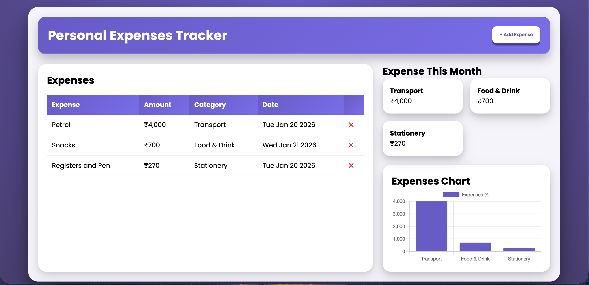
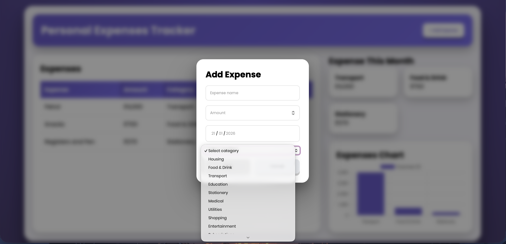

# Expense Tracker

A personal expense tracker built using HTML, CSS, and JavaScript.  
This project allows users to record daily expenses and view category-wise summaries with visual charts.

## Features
- Add and delete expenses
- Category-wise expense breakdown
- Monthly expense overview
- Dynamic expense chart visualization

## Tech Stack
- HTML
- CSS
- JavaScript (DOM manipulation)

## Screenshots

### Dashboard

### Add Expense Modal

## How to Run
Open `index.html` in any modern browser.
